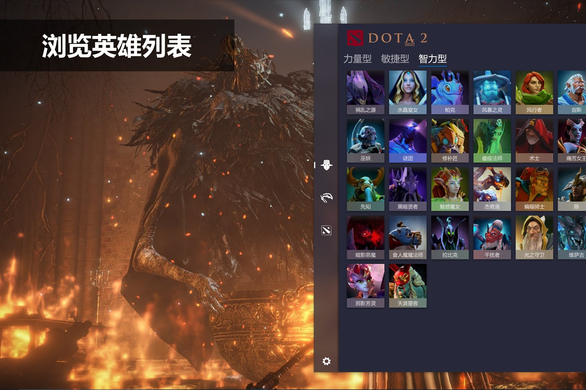
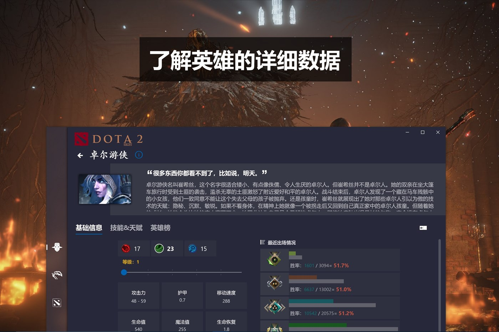
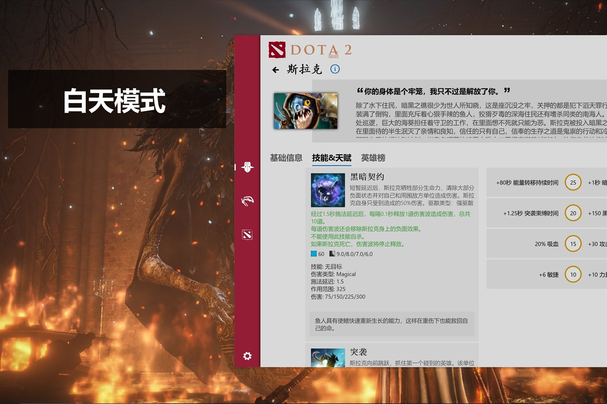
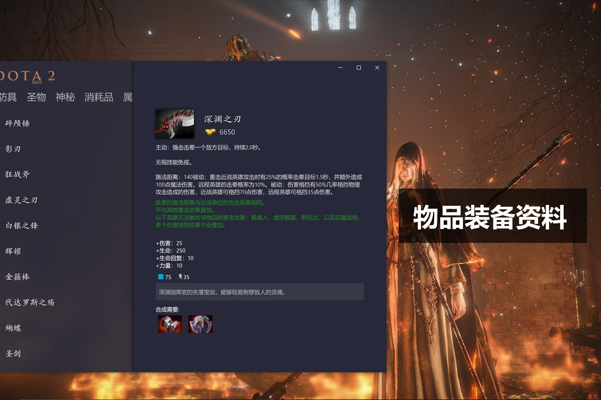
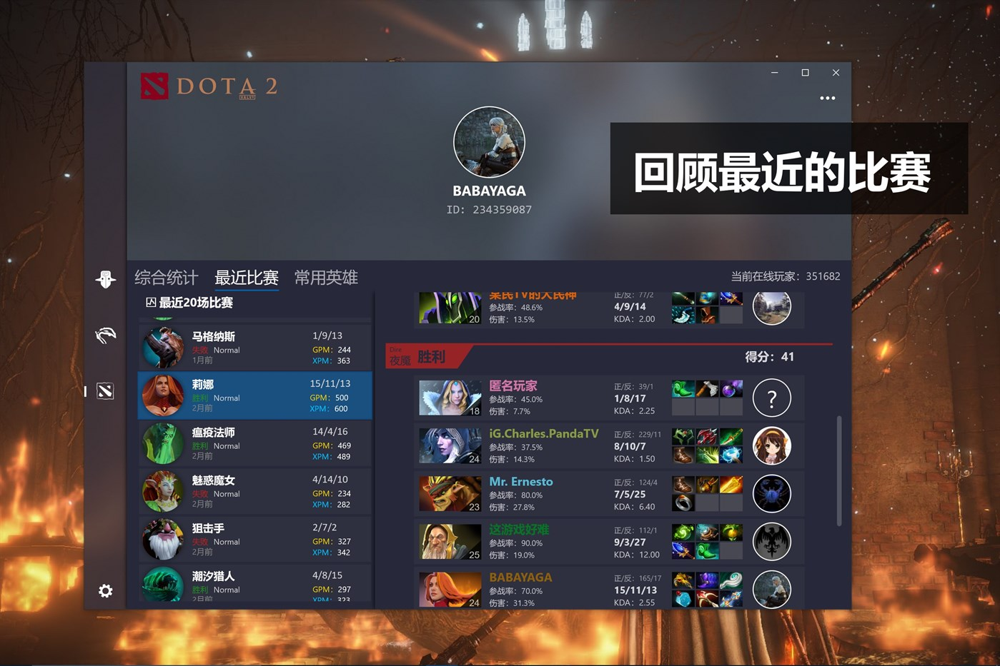
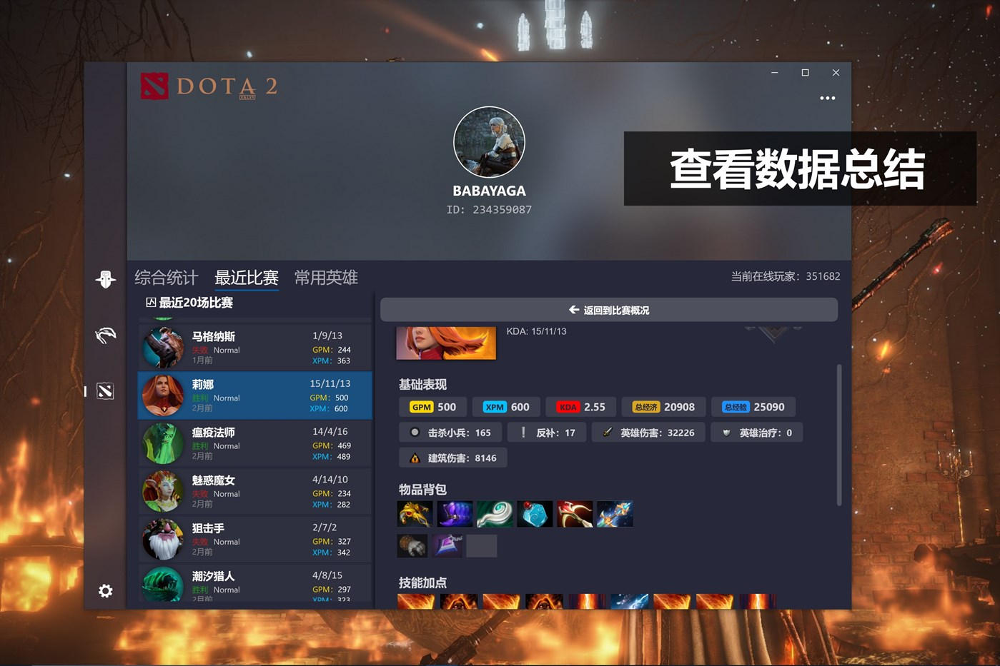

##  <b>OpenDota+ —— 基于 OpenDota 的 Dota 2 战绩查询软件</b>

### OpenDota

> OpenDota is a volunteer-developed, open source platform providing Dota 2 data. It provides a web interface for casual users to browse through the collected data, as well as an API to allow developers to build their own applications with it.
> 
> Data is collected through the Steam WebAPI, as well as replay parsing of .dem files. The replay file contains much more data than the WebAPI, at the cost of additional CPU time spent to process the file. As a result, replay parsing can only be done for a subset of the matches played, while basic data from the API is collected for every public match.

这是一个第三方的应用程序，基于 [OpenDota-UWP](https://github.com/sh0ckj0ckey/OpenDota-UWP) 重制，比赛数据来自 Steam Api 和 OpenDota，英雄和物品信息爬自 Dota 2 官网。如果有任何建议或者侵犯了您的权益，烦请联系开发人员 yaoyiming123@live.com

现在就去 [Microsoft Store](https://www.microsoft.com/store/apps/9NSKQN4V8X94) 下载体验

### 截图

#### 浏览英雄列表

#### 了解英雄数据

#### 支持黑白模式

#### 物品装备资料

#### 回顾最近比赛

#### 查看数据总结

### 引用
| 名字 | 许可类型 | 项目网站 |
| --- | --- | --- |
| UWP Community Toolkit | [MIT License](https://github.com/Microsoft/UWPCommunityToolkit/blob/master/license.md) | [github.com/Microsoft/UWPCommunityToolkit ](https://github.com/Microsoft/UWPCommunityToolkit) |
| Microsoft.UI.Xaml | [MIT License](https://github.com/JamesNK/Newtonsoft.Json/blob/master/LICENSE.md) | [github.com/Microsoft/microsoft-ui-xaml](https://github.com/Microsoft/microsoft-ui-xaml) |
| Json.NET | [MIT License](https://github.com/JamesNK/Newtonsoft.Json/blob/master/LICENSE.md) | [newtonsoft.com](https://www.newtonsoft.com/json) |

### 更新日志
##### 2019/4/13 更新：
* 资源文件更新；
* 界面微改

##### 2019/3/6 更新：
* 欢迎玛尔斯加入 Dota 2

##### 2018/2/1 更新：
* 加入了新的天梯徽章；
* 修改英雄属性计算公式；
* 启用了新的绑定账号页面；
* 界面微调

##### 2018/11/25 更新：
* 加入新物品显示；
* 修改英雄属性计算公式

##### 2018/11/18 更新：
* 加入了白天模式，可以在设置中切换；
* UI 微调；
* 今后将最低支持 1809 版本系统

##### 2018/10/2 更新：
* 现在可以点击比赛数据中的玩家来查看他的详细数据了；
* “关于”按钮移到了左下角，并加入了更新日志

##### 2018/9/6 更新：
* 加入了动态磁贴功能，绑定账号后磁贴将会显示您的一些信息，后期将加入更丰富的磁贴内容；
* 最近完美世界 Dota2 官网的数据似乎有时会出现问题，如果此应用的数据显示异常，请先前往完美世界 Dota2 官网确认，如果官网数据没问题，烦请联系开发者

##### 2018/9/4 更新：
* 加入了天涯墨客的图像资源，但是因为官网还没有新英雄的介绍页面所以无法查看背景故事和技能介绍；
* 又修复了一个导致闪退的 Bug，抱歉；
* 加入了动态磁贴的代码，但是此版本可能无法正常使用

##### 2018/8/5 更新：
* 数据源的格式变化导致此应用闪退的问题得以修复

##### 2018/7/30 更新：
* 更新了新赛季的分段徽章；
* 英雄资料页面改进；
* 提高了英雄头像的加载速度；
* 修复了某些情况下无法显示玩家头像的 bug；
* UI 微调

##### 2018/6/8 更新：
* 界面微调；
* 修复小 bug；
* 新的天梯徽章将在下次更新提供

##### 2018/4/21 更新：
* “英雄”栏目修改了数据来源，现在数据更加准确和丰富；
* UI 调整，似乎更加精致了；
* 提升了稳定性和流畅性

##### 2018/4/13 更新：
* 跟随游戏客户端 7.13 版本更新了英雄属性加成的计算公式；
* 修复了一些可能导致应用崩溃的问题

##### 2018/4/7 更新：
* UI 进行了改进，现在您的眼睛会更舒服；
* 现在您可以查看您的最近 20 场比赛数据；
* 加入了一些动画，修复了一些小问题；
* 已知问题：频繁查看比赛数据可能导致应用崩溃，将在下次解决

##### 2018/3/8 更新：
* 上线基本比赛数据查询功能；
* 修复了物品信息可能显示英文的问题；
* 提升了稳定性

#
[去Microsoft Store下载](https://www.microsoft.com/store/apps/9NSKQN4V8X94)

2019-2022 sh0ckj0ckey.
