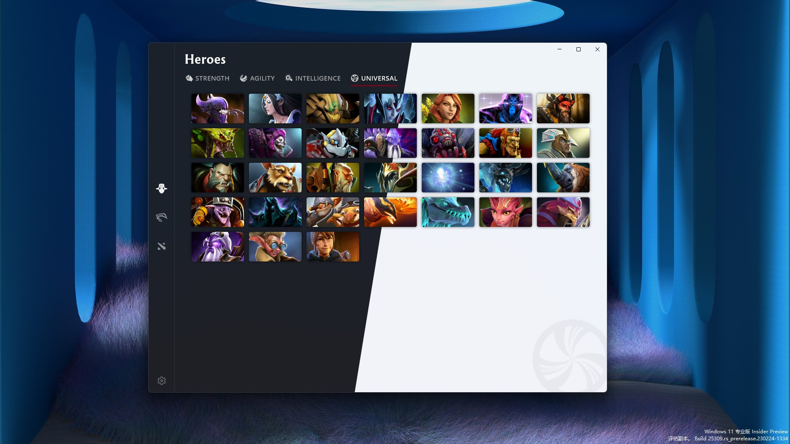
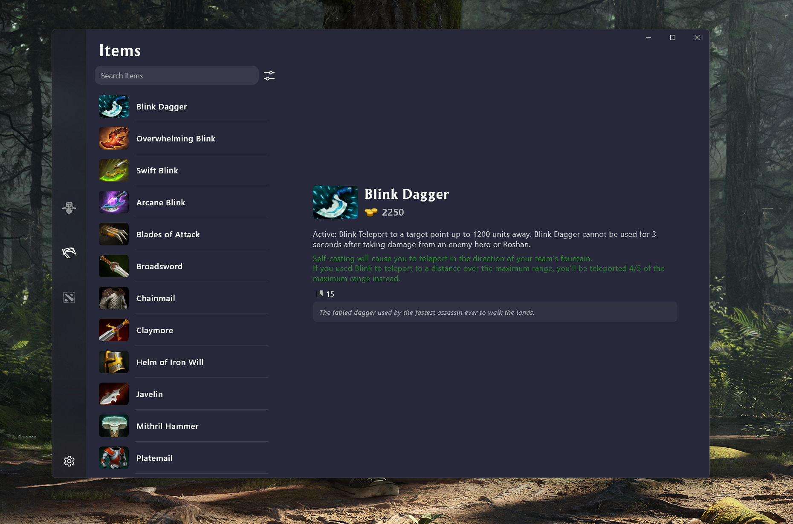
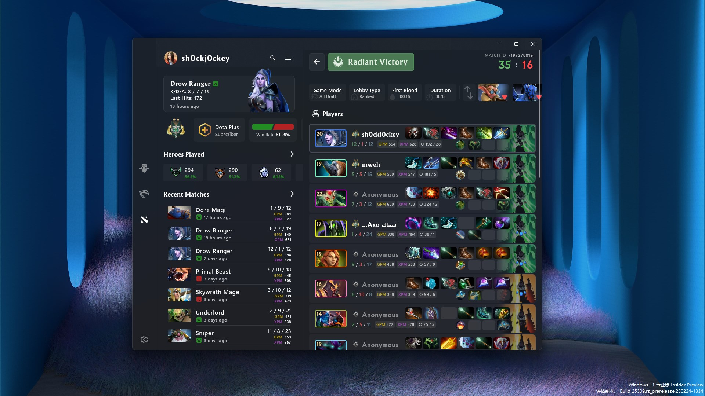
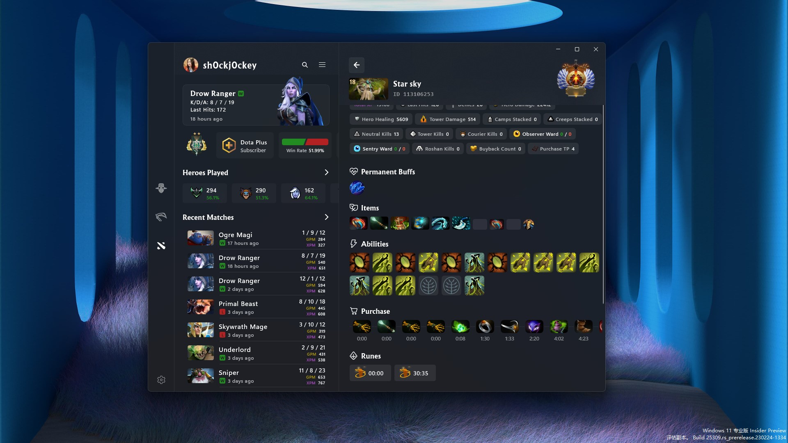
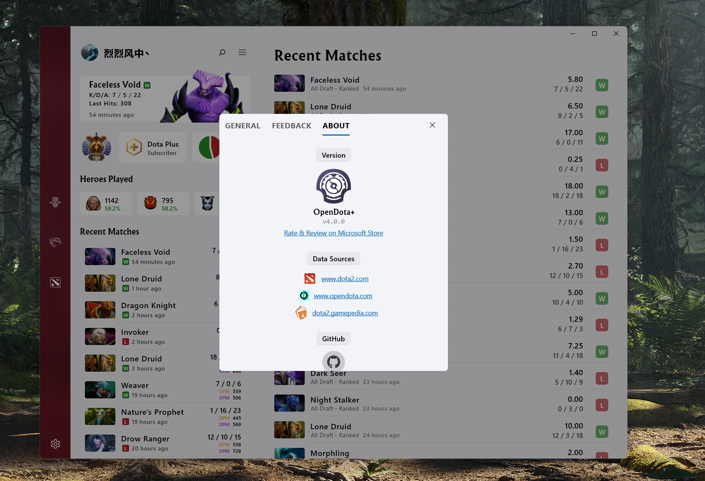

##  <b>Dotahold —— Dota 2 Statistics powered by OpenDota</b>

### OpenDota

> OpenDota is a volunteer-developed, open source platform providing Dota 2 data. It provides a web interface for casual users to browse through the collected data, as well as an API to allow developers to build their own applications with it.
> 
> Data is collected through the Steam WebAPI, as well as replay parsing of .dem files. The replay file contains much more data than the WebAPI, at the cost of additional CPU time spent to process the file. As a result, replay parsing can only be done for a subset of the matches played, while basic data from the API is collected for every public match.

This is a third party application, the match data from Steam Api and OpenDota, and the Heroes' information is from the Dota 2 official website. If you have any suggestions or violate your rights, please contact the developer yaoyiming123@live.com. (The name is taken from the Darkhold in Agents of S.H.I.E.L.D. 🤣)
70% of the proceeds from the sale of the application will be handed over to OpenDota officials.

Go to the [Microsoft Store](https://www.microsoft.com/store/apps/9NSKQN4V8X94) to download to experience

### Screenshots

#### Heroes List

#### Hero Info

#### Items

#### Matches

#### Match Data

#### v4.0

### References
| Name | License | Website |
| --- | --- | --- |
| UWP Community Toolkit | [MIT License](https://github.com/Microsoft/UWPCommunityToolkit/blob/master/license.md) | [github.com/Microsoft/UWPCommunityToolkit ](https://github.com/Microsoft/UWPCommunityToolkit) |
| Microsoft.UI.Xaml | [MIT License](https://github.com/JamesNK/Newtonsoft.Json/blob/master/LICENSE.md) | [github.com/Microsoft/microsoft-ui-xaml](https://github.com/Microsoft/microsoft-ui-xaml) |
| Json.NET | [MIT License](https://github.com/JamesNK/Newtonsoft.Json/blob/master/LICENSE.md) | [newtonsoft.com](https://www.newtonsoft.com/json) |
| OpenDota | [MIT License] | [newtonsoft.com](https://github.com/odota) |

2019-2022 sh0ckj0ckey.
