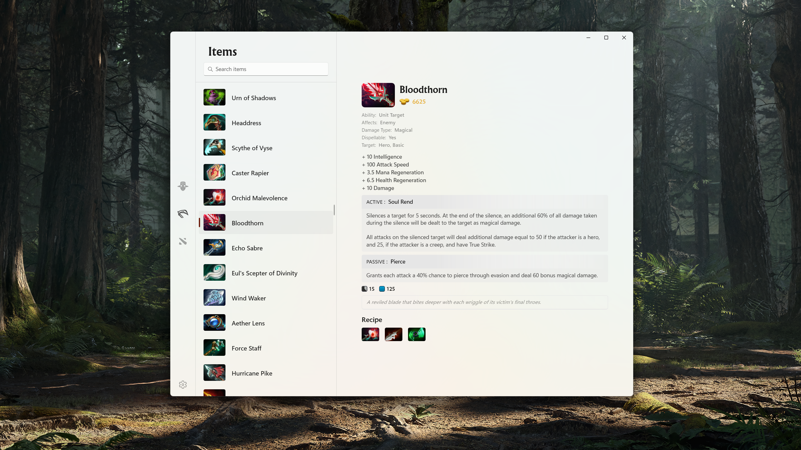

> ### <b>OpenDota</b>
>
> OpenDota is a volunteer-developed, open source platform providing Dota 2 data. It provides a web interface for casual users to browse through the collected data, as well as an API to allow developers to build their own applications with it.
> 
> Data is collected through the Steam WebAPI, as well as replay parsing of .dem files. The replay file contains much more data than the WebAPI, at the cost of additional CPU time spent to process the file. As a result, replay parsing can only be done for a subset of the matches played, while basic data from the API is collected for every public match.

This is a third-party application for Dota 2 statistics, the match data from Steam API and OpenDota, and the Heroes' information is from the Dota 2 official website. If you have any suggestions or violate your rights, please contact the developer. 

---

### Todo List

- [ ] Counter Picker / BanPick Simulator;

### Screenshots

#### Heroes List

#### Hero Info

#### Items

#### Matches

#### Match Detail

### Dota 2 Official API Quick Reference

https://www.dota2.com/datafeed/herolist?language={language}

https://www.dota2.com/datafeed/itemlist?language={language}

https://www.dota2.com/datafeed/abilitylist?language={language}

https://www.dota2.com/datafeed/herodata?language={language}&hero_id={id}

https://www.dota2.com/datafeed/itemdata?language={language}&item_id={id}

https://www.dota2.com/datafeed/abilitydata?language={language}&ability_id={id}

### OpenDota API

https://docs.opendota.com/
